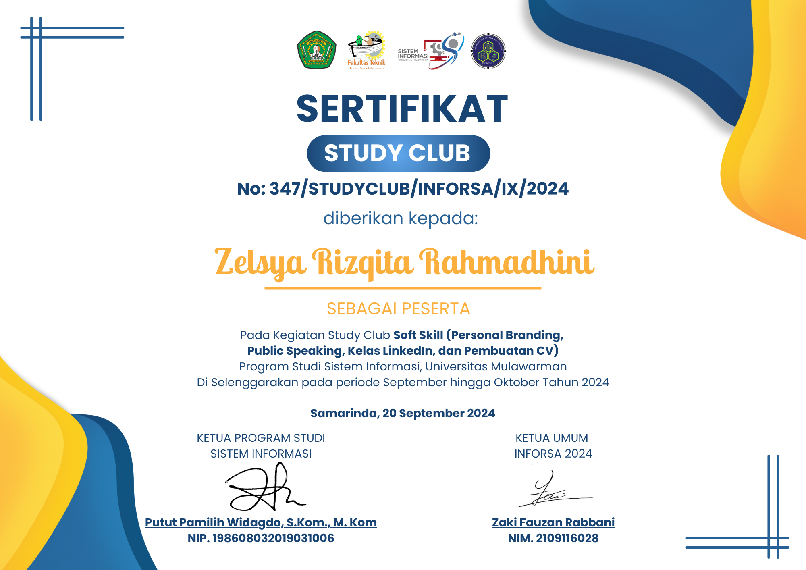
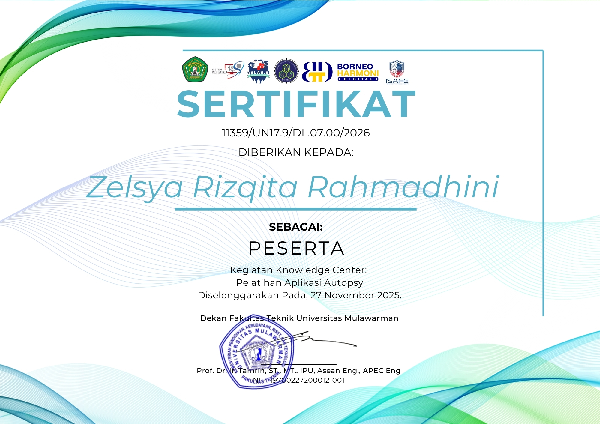
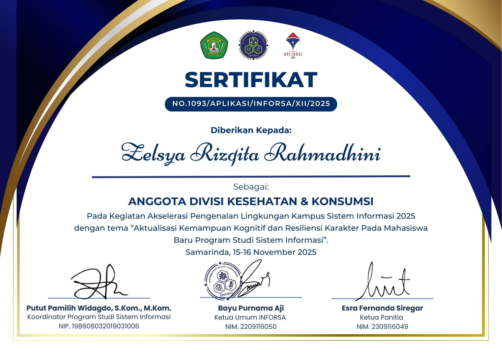
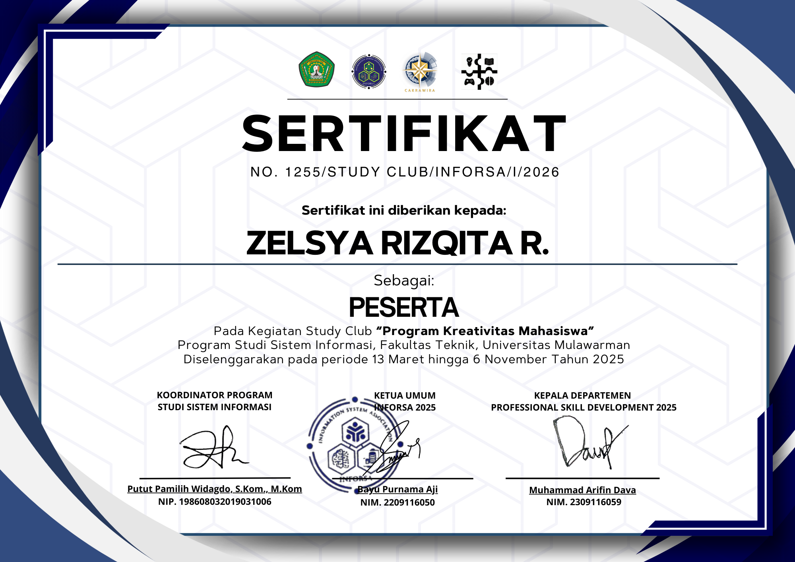
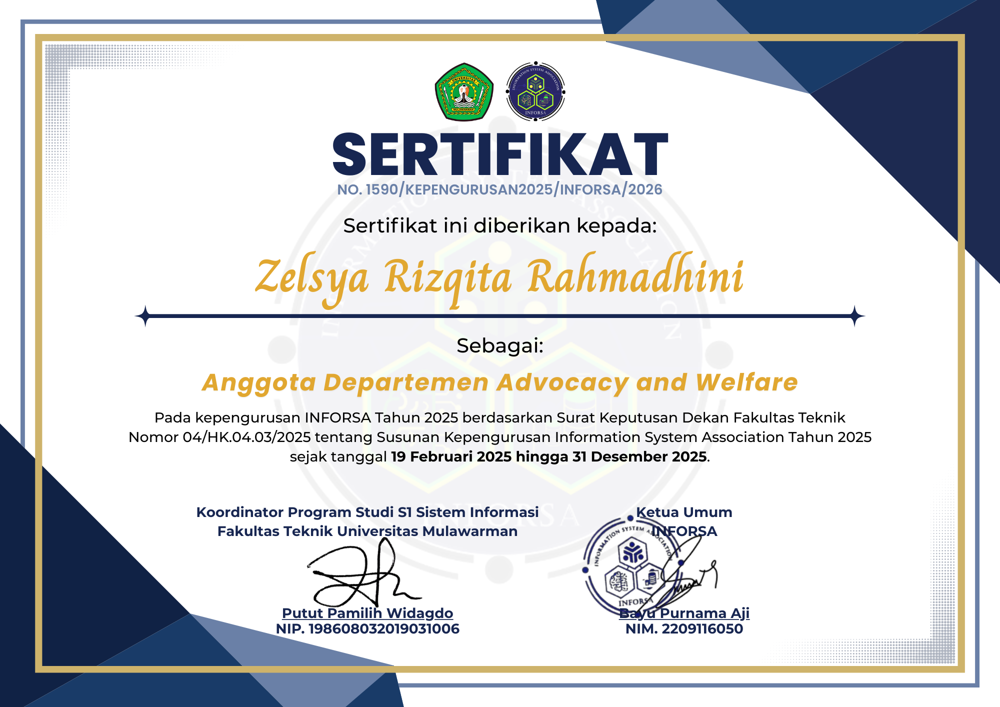
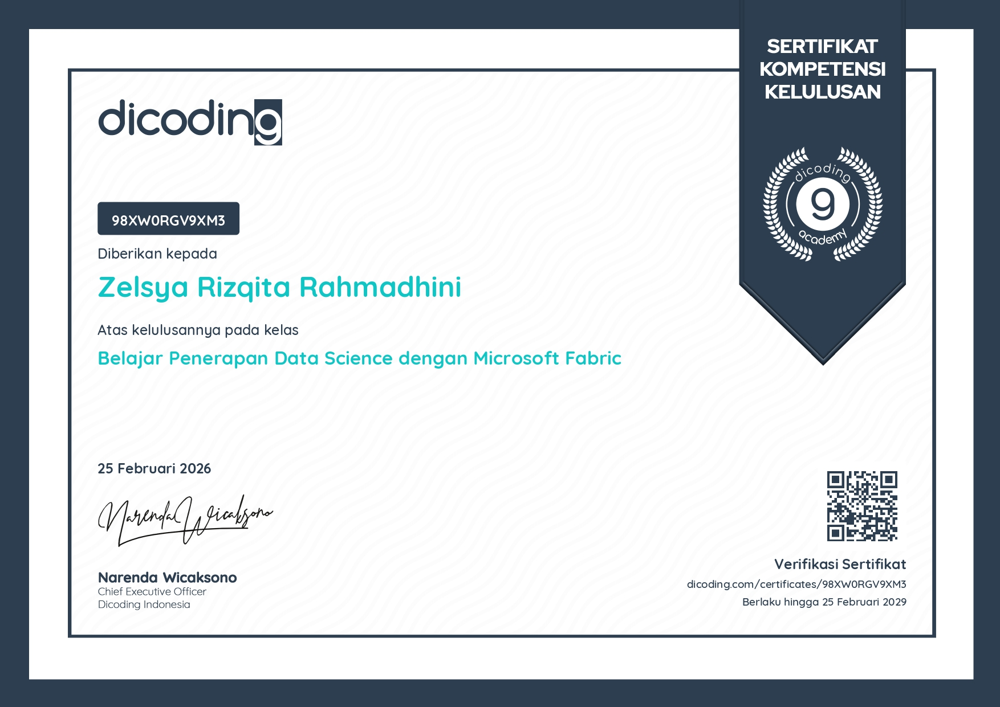
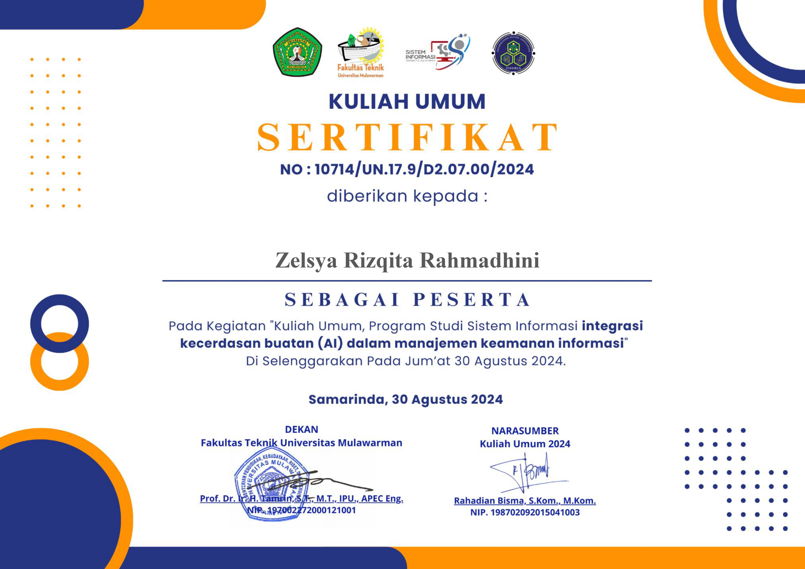
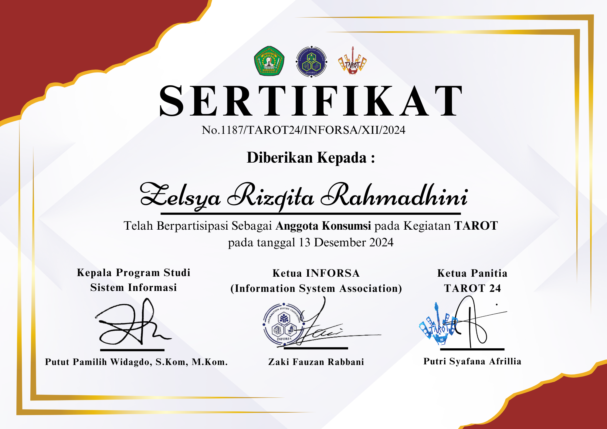
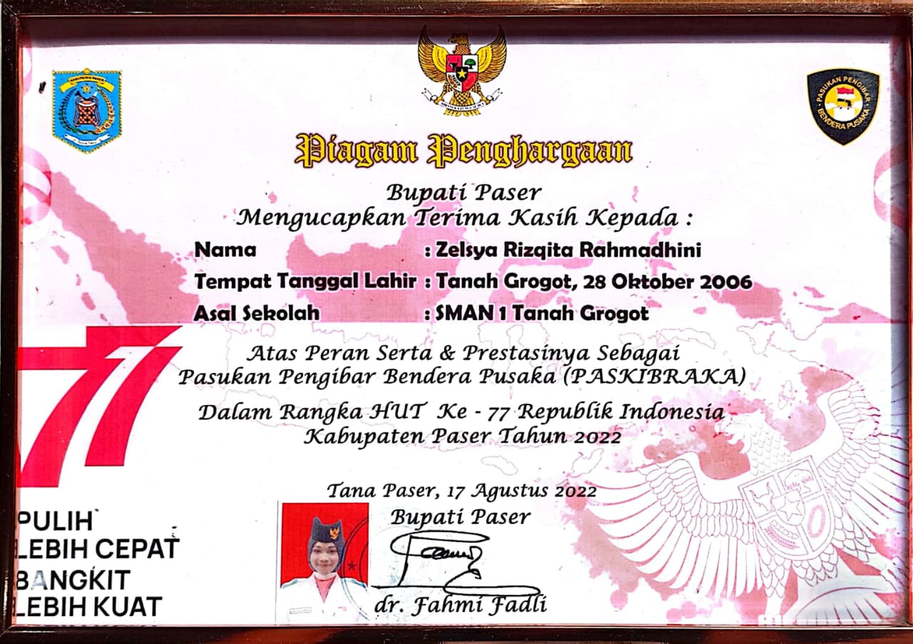

<h1 align="center">
  🌐 Website Portofolio 
</h1>


--- 

## Deskripsi Project
Project ini merupakan website portofolio sederhana yang saya buat menggunakan HTML, CSS, dan Bootstrap 5. 
Website ini bertujuan untuk menampilkan informasi pribadi seperti perkenalan singkat, deskripsi diri, kemampuan yang saya miliki, pengalaman, serta daftar sertifikat yang pernah saya dapatkan.

Tampilan website dibuat dengan desain yang clean dan rapi agar nyaman dilihat. 
Selain itu, website ini juga sudah responsif sehingga tetap terlihat baik ketika dibuka melalui laptop maupun perangkat mobile. 
Layout dan styling dibantu menggunakan Bootstrap 5, terutama untuk bagian navbar, grid system, card, dan progress bar pada section skills.

--- 

## Struktur Folder

> 

Project ini terdiri dari file index.html sebagai struktur utama website dan style.css sebagai pengatur tampilan desainnya, serta folder images yang berisi gambar profil dan sertifikat. File index.html berisi susunan halaman seperti Navbar, Home, About Me, Certificates, dan Footer yang disusun menggunakan struktur HTML dan dibantu Bootstrap untuk layout agar responsif. Sementara itu, style.css digunakan untuk mengatur warna, font, jarak, background, serta tampilan card dan progress bar agar website terlihat rapi, clean, dan sesuai dengan desain yang diinginkan.

--- 

## Website Preview

> 

---

## Tampilan Setiap Section / Fitur

### ➤ Navbar

> 

Navbar berada di bagian atas website dan berfungsi sebagai navigasi utama untuk berpindah ke setiap section seperti Home, About Me, dan Certificates. Navbar dibuat responsif sehingga tetap rapi saat dibuka di berbagai ukuran layar.

### ➤ Home (Hero Section)

> 


Home atau Hero Section merupakan bagian pertama yang tampil saat website dibuka. Section ini berisi foto profil dan perkenalan singkat mengenai diri, termasuk latar belakang dan minat di bidang teknologi. Desain dibuat sederhana dan clean agar memberikan kesan profesional serta memudahkan pengunjung memahami identitas pemilik website sejak awal.

### ➤ About Me

> 

Section About Me berisi penjelasan lebih detail mengenai diri, termasuk deskripsi singkat tentang pendidikan dan ketertarikan di bidang pengembangan website. Pada bagian ini juga terdapat daftar skills yang ditampilkan dalam bentuk progress bar untuk menunjukkan tingkat kemampuan pada masing-masing bidang. Selain itu, terdapat informasi pengalaman yang pernah dijalani, seperti kegiatan akademik maupun non-akademik. Seluruh isi section ini disusun dengan layout yang rapi agar mudah dibaca dan dipahami.

### ➤ Certificates

> 

Section Certificates menampilkan daftar sertifikat yang dimiliki dalam bentuk card menggunakan sistem grid. Setiap card berisi gambar sertifikat serta tombol untuk melihat sertifikat secara lebih jelas. Penggunaan Bootstrap Grid System membuat susunan card tetap teratur dan otomatis menyesuaikan dengan ukuran layar, sehingga tampilan tetap responsif dan tidak berantakan saat diakses dari perangkat yang berbeda.

### ➤ Footer

> 

Footer terletak di bagian paling bawah website dan berfungsi sebagai penutup halaman. Bagian ini berisi informasi copyright dan dibuat dengan desain sederhana agar tetap selaras dengan keseluruhan tampilan website. Footer membantu memberikan batas akhir yang jelas pada halaman serta membuat tampilan website terlihat lebih lengkap dan profesional.

--- 

## Penjelasan Kode setiap Section/Fitur

---

### Penjelasan Kode – Home (Hero Section)
``` bash
<section id="home" class="home-section">
    <div class="container">
        <div class="home-card">
            <div class="row align-items-center">
                <div class="col-md-4 text-center">
                    
                </div>
                <div class="col-md-8 home-text">
                    <h1 class="hero-title">
                        Hello,<br>I'm Zelsya!
                    </h1>
                    <p class="lead mt-3">
                        My name is Zelsya Rizqita Rahmadhini,
                        an Information Systems student who has an interest in technology and website development.
                    </p>
                </div>
            </div>
        </div>
    </div>
</section>
```

Pada bagian Home (Hero Section), struktur utama dibuat menggunakan elemen <section> dengan atribut id="home" agar dapat diakses melalui navigasi navbar. Section ini menjadi tampilan pertama saat website dibuka sehingga dirancang untuk memberikan kesan awal yang profesional dan informatif. Di dalamnya digunakan elemen container, row, dan col-md-* dari Bootstrap untuk membagi layout menjadi dua kolom. Kolom pertama digunakan untuk menampilkan foto profil, sedangkan kolom kedua digunakan untuk teks perkenalan seperti heading dan deskripsi singkat. Penggunaan sistem grid Bootstrap ini membantu tata letak tetap rapi dan otomatis responsif di berbagai ukuran layar.

Bagian teks terdiri dari elemen h1 sebagai judul utama dan <p> sebagai deskripsi singkat. Class seperti lead dan mt-3 digunakan untuk memberikan jarak dan tampilan yang lebih proporsional. Styling tambahan seperti warna, font Playfair Display, serta pengaturan ukuran teks diatur melalui file CSS terpisah (style.css) agar desain terlihat konsisten.
Secara keseluruhan, section ini menggabungkan HTML sebagai struktur utama, Bootstrap untuk sistem grid dan responsivitas, serta CSS untuk pengaturan tampilan visual seperti warna, spacing, dan typography.

---

### About Me Section
``` bash
<!-- ================= ABOUT SECTION ================= -->
<section id="about" class="about-section">

    <div class="container text-center mb-5">
        <h2>About Me</h2>
        <p> I'am an Information Systems student at Mulawarman University with an interest in technology.
            During my studies, I have studied and worked on various programming and data management-based projects. 
            I'am interested in continuing to learn and develop my skills in the world of technology, particularly website development.</p>
    </div>
    <!-- CARDS -->
    <div class="container">
        <div class="row g-4">

    <!-- SKILLS -->
    <div class="col-md-6 mb-4">
    <div class="custom-card text-center">
        <div class="icon-circle">
            💻
        </div>
        <h3 class="mt-3">My Skills</h3>

        <div class="d-flex justify-content-between mt-3">
            <span>Programming</span>
            <span>85%</span>
        </div>
        <div class="skill-bar">
            <div class="skill-fill" style="width:85%"></div>
        </div>

        <div class="d-flex justify-content-between mt-4">
            <span>Canva Design</span>
            <span>90%</span>
        </div>
        <div class="skill-bar">
            <div class="skill-fill" style="width:90%"></div>
        </div>

        <div class="d-flex justify-content-between mt-3">
            <span>Communication</span>
            <span>88%</span>
        </div>
        <div class="skill-bar">
            <div class="skill-fill" style="width:88%"></div>
        </div>

        <div class="d-flex justify-content-between mt-3">
            <span>Public Speaking</span>
            <span>82%</span>
        </div>
        <div class="skill-bar">
            <div class="skill-fill" style="width:82%"></div>
        </div>

        <div class="d-flex justify-content-between mt-3">
            <span>Teamwork</span>
            <span>87%</span>
        </div>
        <div class="skill-bar">
            <div class="skill-fill" style="width:87%"></div>
        </div>

    </div>
</div>

    <!-- EXPERIENCE -->
    <div class="col-md-6 mb-4">
        <div class="custom-card text-center">
            <div class="icon-circle">
                💼
            </div>

            <h3 class="mt-3">Experience</h3>

            <ul class="text-start mt-4">
            <li>Developing systems-based and programming projects</li>
            <li>Participating in technology workshops, bootcamps, and seminars</li>
            <li>Actively participating in campus organizations and committees</li>
            <li>Presenting projects as part of developing communication skills</li>
            <li>Participating in Biology and Mathematics Olympiads</li>
            </ul>

        </div>
    </div>

</div>

```

Pada bagian About Me, struktur halaman dibuat agar dapat terhubung langsung dengan menu navigasi sehingga pengguna bisa mengaksesnya melalui navbar. Section ini diawali dengan judul dan paragraf deskripsi yang menjelaskan latar belakang pendidikan, minat, serta ketertarikan di bidang teknologi. Tata letaknya menggunakan sistem grid dari Bootstrap untuk membagi konten menjadi dua bagian utama, yaitu bagian Skills dan Experience. Pembagian ini membuat tampilan lebih terstruktur, seimbang, dan mudah dipahami oleh pengunjung.
Pada bagian Skills, kemampuan ditampilkan dalam bentuk progress bar yang menunjukkan persentase tingkat penguasaan. Panjang setiap bar disesuaikan dengan nilai kemampuan sehingga memberikan gambaran visual yang jelas mengenai tingkat skill yang dimiliki. Tampilan progress bar diatur melalui CSS agar terlihat menarik, rapi, dan konsisten dengan desain keseluruhan website.

Sementara itu, bagian Experience menampilkan daftar pengalaman dalam bentuk poin-poin agar informasi lebih terorganisir dan mudah dibaca. Pengaturan jarak, perataan teks, serta spacing antar elemen dibantu oleh class dari Bootstrap sehingga tampilan tetap proporsional dan responsif di berbagai ukuran layar.

### Certificates Section

``` bash
<!-- ================= CERTIFICATES SECTION ================= -->
<section id="certificates" class="certificates-section">

    <div class="container">
        <div class="home-card">  <!-- pakai style card cream -->

            <h2 class="section-title text-center mb-5">Certificates</h2>

            <div class="row g-4">
                <!-- semua card sertifikat kamu di sini -->

            <div class="col-sm-12 col-md-6 col-lg-4 mb-4">
                <div class="card cert-card">
                    
                    <div class="card-body text-center p-3">
                        <h5 class="card-title mb-3"> 
                        <a href="images/sertif1.png" target="_blank" class="btn btn-brown">
                            View Sertifikat
                        </a>
                        </h5>
                    </div>
                </div>
            </div>

           
            <div class="col-sm-12 col-md-6 col-lg-4 mb-4">
                <div class="card cert-card">
                    
                    <div class="card-body text-center p-4">
                        <h5 class="card-title mb-3">
                        <a href="images/sertif2.jpg" target="_blank" class="btn btn-brown">
                            View Sertifikat
                        </a>
                        </h5>
                    </div>
                </div>
            </div>

            <div class="col-sm-12 col-md-6 col-lg-4 mb-4">
                <div class="card cert-card">
                    
                    <div class="card-body text-center p-4">
                        <h5 class="card-title mb-3">
                        <a href="images/sertif3.jpg" target="_blank" class="btn btn-brown">
                            View Sertifikat
                        </a>
                        </h5>
                    </div>
                </div>
            </div>

            <div class="col-sm-12 col-md-6 col-lg-4 mb-4">
                <div class="card cert-card">
                    
                    <div class="card-body text-center p-4">
                        <h5 class="card-title mb-3">
                        <a href="images/sertif4.png" target="_blank" class="btn btn-brown">
                            View Sertifikat
                        </a>
                        </h5>
                    </div>
                </div>
            </div>

            <div class="col-sm-12 col-md-6 col-lg-4 mb-4">
                <div class="card cert-card">
                    
                    <div class="card-body text-center p-4">
                        <h5 class="card-title mb-3">
                        <a href="images/sertif5.png" target="_blank" class="btn btn-brown">
                            View Sertifikat
                        </a>
                        </h5>
                    </div>
                </div>
            </div>

            <div class="col-sm-12 col-md-6 col-lg-4 mb-4">
                <div class="card cert-card">
                    
                    <div class="card-body text-center p-4">
                        <h5 class="card-title mb-3">
                        <a href="images/sertif6.jpg" target="_blank" class="btn btn-brown">
                            View Sertifikat
                        </a>
                        </h5>
                    </div>
                </div>
            </div>

            <div class="col-sm-12 col-md-6 col-lg-4 mb-4">
                <div class="card cert-card">
                    
                    <div class="card-body text-center p-4">
                        <h5 class="card-title mb-3">
                        <a href="images/sertif7.jpg" target="_blank" class="btn btn-brown">
                            View Sertifikat
                        </a>
                        </h5>
                    </div>
                </div>
            </div>

            <div class="col-sm-12 col-md-6 col-lg-4 mb-4">
                <div class="card cert-card">
                    
                    <div class="card-body text-center p-4">
                        <h5 class="card-title mb-3">
                        <a href="images/sertif8.png" target="_blank" class="btn btn-brown">
                            View Sertifikat
                        </a>
                        </h5>
                    </div>
                </div>
            </div>
  
            <div class="col-sm-12 col-md-6 col-lg-4 mb-4">
                <div class="card cert-card">
                    
                    <div class="card-body text-center p-4">
                        <h5 class="card-title mb-3">
                        <a href="images/sertif9.jpeg" target="_blank" class="btn btn-brown">
                            View Sertifikat
                        </a>
                        </h5>
                    </div>
                </div>
            </div>

    </div>
    </div>
</section>
```
Pada bagian Certificates, struktur dibuat agar dapat terhubung dengan menu navigasi sehingga pengguna dapat langsung menuju ke bagian ini melalui navbar. Section ini dirancang khusus untuk menampilkan daftar sertifikat dalam tampilan yang tersusun rapi dan responsif. Tata letaknya menggunakan sistem grid dari Bootstrap untuk mengatur jarak antar card dan membagi tampilan menjadi beberapa kolom yang menyesuaikan ukuran layar. Pada layar kecil, sertifikat ditampilkan dalam satu kolom, pada layar sedang menjadi dua kolom, dan pada layar besar menjadi tiga kolom. Pengaturan ini membuat tampilan tetap fleksibel, tidak berantakan, dan nyaman dilihat di berbagai perangkat.

Setiap sertifikat ditampilkan dalam bentuk card yang berisi gambar sertifikat dan tombol untuk melihat versi yang lebih besar. Ketika tombol diklik, gambar akan terbuka di tab baru sehingga pengguna dapat melihat detail sertifikat dengan lebih jelas. Tampilan visual seperti sudut card yang melengkung, warna tombol, dan jarak antar elemen diatur melalui file CSS agar desain tetap konsisten dengan tema keseluruhan website.

### Navbar

```bash
<!-- ================= NAVBAR ================= -->
<nav class="navbar navbar-expand-lg navbar-light fixed-top custom-navbar">
    <div class="container">
        <a class="navbar-brand fw-bold" href="#">Zelsya's Portfolio</a>

        <button class="navbar-toggler" type="button" data-bs-toggle="collapse" data-bs-target="#navbarNav">
            <span class="navbar-toggler-icon"></span>
        </button>

        <div class="collapse navbar-collapse justify-content-end" id="navbarNav">
            <ul class="navbar-nav">
                <li class="nav-item">
                    <a class="nav-link" href="#home">Home</a>
                </li>
                <li class="nav-item">
                    <a class="nav-link" href="#about">About Me</a>
                </li>
                <li class="nav-item">
                    <a class="nav-link" href="#certificates">Certificates</a>
                </li>
            </ul>
        </div>
    </div>
</nav>
```
Pada bagian Navbar, struktur dibuat sebagai navigasi utama yang berada di bagian paling atas halaman. Navbar ini dirancang agar selalu terlihat saat halaman digulir karena menggunakan posisi tetap di atas (fixed top). Hal ini memudahkan pengguna untuk berpindah ke setiap section tanpa perlu scroll kembali ke atas. Navbar menggunakan komponen dari Bootstrap sehingga tampilannya responsif dan dapat menyesuaikan ukuran layar. Pada tampilan desktop, menu navigasi akan terlihat secara horizontal di sebelah kanan, sedangkan pada perangkat dengan layar lebih kecil, menu akan berubah menjadi tombol toggle (hamburger menu) yang dapat dibuka dan ditutup. Fitur ini membuat tampilan tetap rapi dan tidak berantakan di berbagai perangkat.

Di dalam navbar terdapat nama atau brand website yang ditampilkan di sisi kiri sebagai identitas utama. Sementara itu, di sisi kanan terdapat menu navigasi yang mengarah ke section Home, About Me, dan Certificates. Setiap menu menggunakan sistem anchor link sehingga ketika diklik, halaman akan langsung berpindah ke bagian yang sesuai tanpa membuka halaman baru.

### Footer
```bash
<footer class="custom-footer">
    © 2026 Zelsya Rizqita | Portfolio Website
</footer>
```
Pada bagian Footer, struktur dibuat sebagai penutup halaman yang terletak di bagian paling bawah website. Footer ini berfungsi untuk memberikan informasi tambahan sekaligus menandai akhir dari konten halaman. Isi dari footer menampilkan informasi copyright sebagai bentuk identitas pemilik website dan tahun pembuatan project.
Tampilan footer dibuat sederhana agar tetap selaras dengan desain keseluruhan website. Pengaturan seperti warna background, warna teks, ukuran font, serta posisi teks di tengah diatur melalui class khusus pada file CSS.
